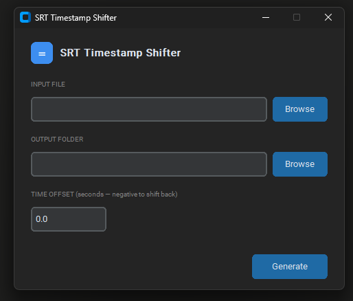

# 🎲 Subtitle Sync Editor - CustomTkinter App
A simple `.srt` editor for subtitle-audio synchronization.

## 🪪 Project Overview
This project implements a simple tool used to import `.srt` files and adjust every subtitle timestamp inside the file to a specified amount of seconds.
In this repo, we have the subtitles for the movie "Project Hail Mary" as an example.

## 📄 How to use
If you want, there is a portable version of this app ready to download in this repository. Just download it and place it in whanever directory you prefer to start using it. This building process was made using the `pyinstaller` package.

But, if you want to execute it by yourself and make it some tweaks, just clone this repository and then follow these steps:

### 💻 Workflow
1. Import the `.srt` file
2. Specify the output folder location
3. Click on Generate for the new file
After the new file was generated, import it using your favorite video player.

You can make your own build by running the bat located at `dev/build.bat` after you done changing your preferences. Once the building process is done, you can safely delete `build/`, `dist/` (after you take the `.exe` file generated inside it) and the `SRT Timestamp Shifter.spec` file. These all are temporary files used in the build process.

---
*Developed by [Diego Freire](https://github.com/diegofreiregit)*